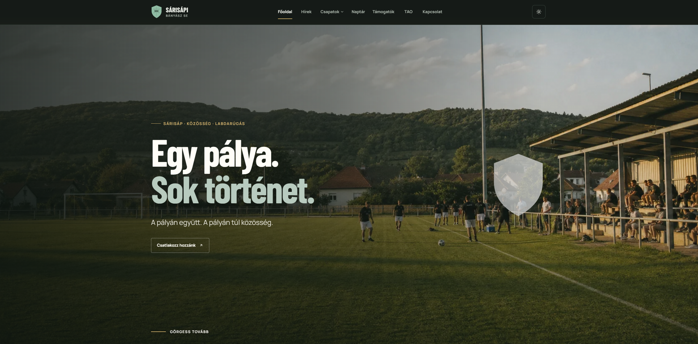
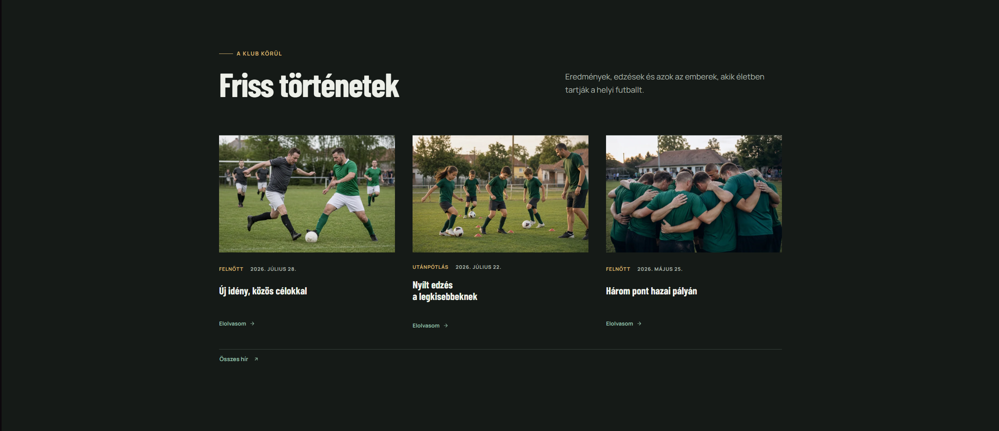
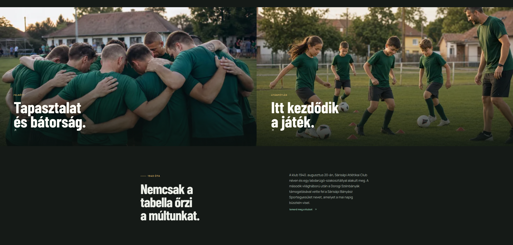
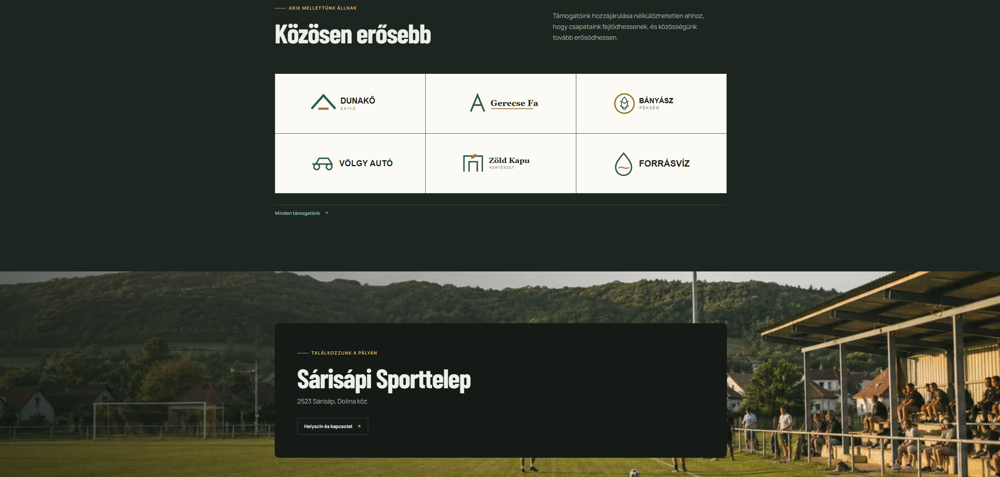
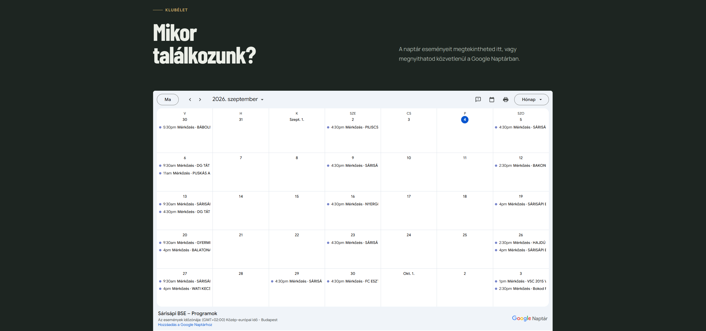
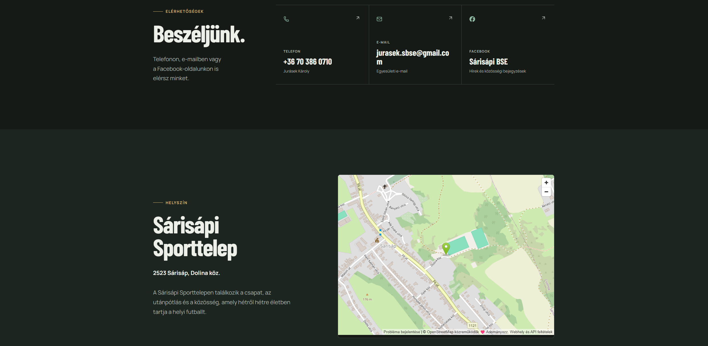

# Sárisápi BSE kluboldal

Ez a weboldal azért készült, hogy egy helyen mutassa be a Sárisápi Bányász Sport
Egyesületet. A látogatók elolvashatják a klub híreit, megismerhetik a csapatokat és
az edzőket, követhetik a mérkőzéseket, valamint megtalálhatják a programokat, a
kapcsolattartási adatokat, a támogatókat és a TAO-dokumentumokat. Az oldal telefonon
és számítógépen is kényelmesen használható.

A mérkőzések és a játékoskeretek adatai az MLSZ Adatbankból érkeznek.

## Főbb funkciók

- klubhírek és kiemelt hírek;
- öt csapat bemutatása, edzésidőpontokkal és stábbal;
- automatikusan frissülő MLSZ-mérkőzések és játékoskeretek;
- közös klubnaptár mérkőzésekkel és kézzel felvitt programokkal;
- kapcsolattartási adatok, támogatók és TAO-dokumentumok;
- világos és sötét megjelenés.

## Képernyőképek

